# Screenshots

* [Current mode](#current-mode)
    * Theme [uni](#theme-uni)
    * Theme [hl-dark](#theme-hl-dark-or-hl-light) or [hl-light](#theme-hl-dark-or-hl-light)
    * Theme [one-dark-24](#theme-one-dark-24-or-one-light-24) or [one-light-24](#theme-one-dark-24-or-one-light-24)
    * Theme [ayu-dark-24](#theme-ayu-dark-24-or-ayu-light-24) or [ayu-light-24](#theme-ayu-dark-24-or-ayu-light-24)
    * Theme [ayu-mirage-24](#theme-ayu-mirage-24)
    * Theme [classic](#theme-classic-or-classic-light) or [classic-light](#theme-classic-or-classic-light)
    * Theme [dmt](#theme-dmt)
    * Theme [lsd](#theme-lsd)
    * Theme [neutral](#theme-neutral)
    * Theme [one-dark-blue](#theme-one-dark-blue)
    * Theme [one-dark-blue-truecolor](#theme-one-dark-blue-truecolor)
    * Theme [one-dark-blue-x](#theme-one-dark-blue-x)
    * Theme [one-dark-green](#theme-one-dark-green)
    * Theme [one-dark-green-truecolor](#theme-one-dark-green-truecolor)
    * Theme [one-dark-green-x](#theme-one-dark-green-x)
    * Theme [tc24d-blue](#theme-tc24d-blue-or-tc24l-blue) or [tc24l-blue](#theme-tc24d-blue-or-tc24l-blue)
    * Theme [tc24d-b2](#theme-tc24d-b2-or-tc24l-b2) or [tc24l-b2](#theme-tc24d-b2-or-tc24l-b2)
    * Theme [universal](#theme-universal)
    * Theme [universal-blue](#theme-universal-blue)
* [Dark mode](#dark-mode)
    * Theme [uni](#theme-uni-1)
    * Theme [hl-dark](#theme-hl-dark)
    * Theme [one-dark-24](#theme-one-dark-24)
    * Theme [ayu-dark-24](#theme-ayu-dark-24)
    * Theme [ayu-mirage-24](#theme-ayu-mirage-24-1)
    * Theme [classic](#theme-classic)
    * Theme [dmt](#theme-dmt-1)
    * Theme [lsd](#theme-lsd-1)
    * Theme [neutral](#theme-neutral-1)
    * Theme [one-dark-blue](#theme-one-dark-blue-1)
    * Theme [one-dark-blue-truecolor](#theme-one-dark-blue-truecolor-1)
    * Theme [one-dark-blue-x](#theme-one-dark-blue-x-1)
    * Theme [one-dark-green](#theme-one-dark-green-1)
    * Theme [one-dark-green-truecolor](#theme-one-dark-green-truecolor-1)
    * Theme [one-dark-green-x](#theme-one-dark-green-x-1)
    * Theme [tc24d-blue](#theme-tc24d-blue)
    * Theme [tc24d-b2](#theme-tc24d-b2)
    * Theme [universal](#theme-universal-1)
    * Theme [universal-blue](#theme-universal-blue-1)
* [Light mode](#light-mode)
    * Theme [uni](#theme-uni-2)
    * Theme [hl-light](#theme-hl-light)
    * Theme [one-light-24](#theme-one-light-24)
    * Theme [ayu-light-24](#theme-ayu-light-24)
    * Theme [ayu-mirage-24](#theme-ayu-mirage-24-2)
    * Theme [classic](#theme-classic-light)
    * Theme [dmt](#theme-dmt-2)
    * Theme [lsd](#theme-lsd-2)
    * Theme [neutral](#theme-neutral-2)
    * Theme [one-dark-blue](#theme-one-dark-blue-2)
    * Theme [one-dark-blue-truecolor](#theme-one-dark-blue-truecolor-2)
    * Theme [one-dark-blue-x](#theme-one-dark-blue-x-2)
    * Theme [one-dark-green](#theme-one-dark-green-2)
    * Theme [one-dark-green-truecolor](#theme-one-dark-green-truecolor-2)
    * Theme [one-dark-green-x](#theme-one-dark-green-x-2)
    * Theme [tc24l-blue](#theme-tc24l-blue)
    * Theme [tc24l-b2](#theme-tc24l-b2)
    * Theme [universal](#theme-universal-2)
    * Theme [universal-blue](#theme-universal-blue-2)

## Current mode

### Theme "uni"

### Theme "hl-dark" or "hl-light"

### Theme "one-dark-24" or "one-light-24"

### Theme "ayu-dark-24" or "ayu-light-24"

### Theme "ayu-mirage-24"

### Theme "classic" or "classic-light"

### Theme "classic-plus"

### Theme "dmt"

### Theme "lsd"

### Theme "neutral"

### Theme "one-dark-blue"

### Theme "one-dark-blue-truecolor"

### Theme "one-dark-blue-x"

### Theme "one-dark-green"

### Theme "one-dark-green-truecolor"

### Theme "one-dark-green-x"

### Theme "tc24d-blue" or "tc24l-blue"

### Theme "tc24d-b2" or "tc24l-b2"

### Theme "universal"

### Theme "universal-blue"

## Dark mode

### Theme "uni"
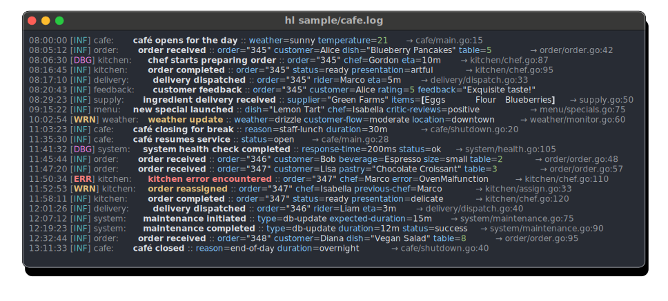

### Theme "hl-dark"
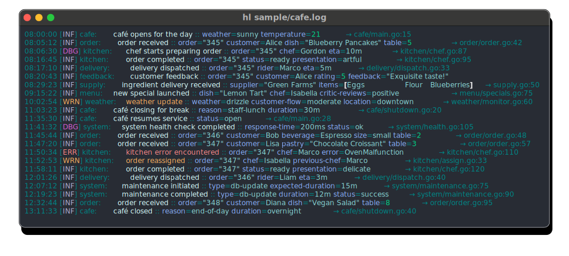

### Theme "one-dark-24"

### Theme "ayu-dark-24"

### Theme "ayu-mirage-24"
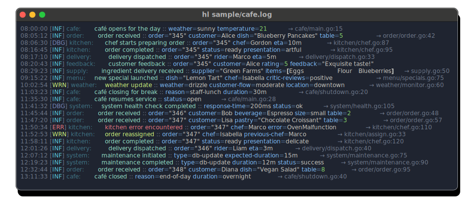

### Theme "classic"
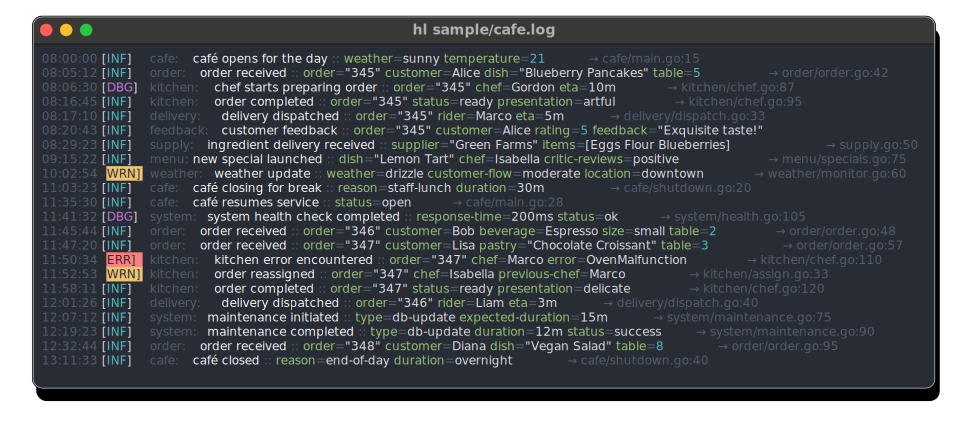

### Theme "classic-plus"

### Theme "dmt"

### Theme "lsd"

### Theme "neutral"
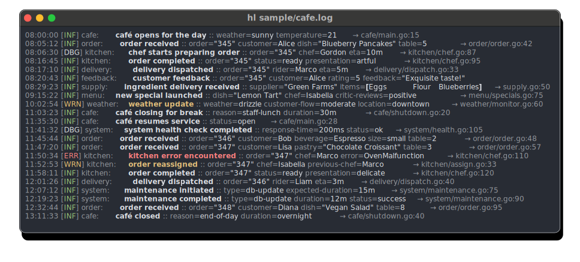

### Theme "one-dark-blue"

### Theme "one-dark-blue-truecolor"

### Theme "one-dark-blue-x"

### Theme "one-dark-green"

### Theme "one-dark-green-truecolor"

### Theme "one-dark-green-x"

### Theme "tc24d-blue"

### Theme "tc24d-b2"
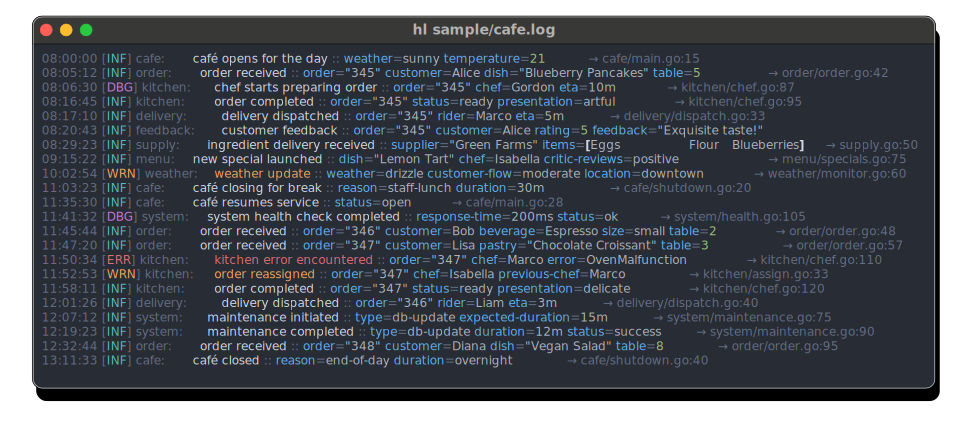

### Theme "universal"
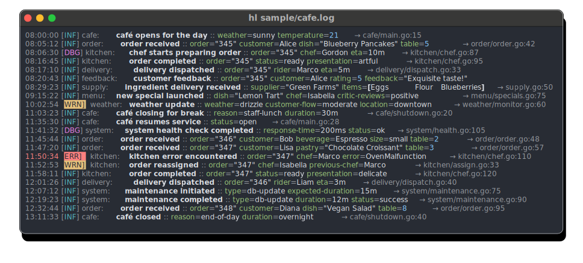

### Theme "universal-blue"
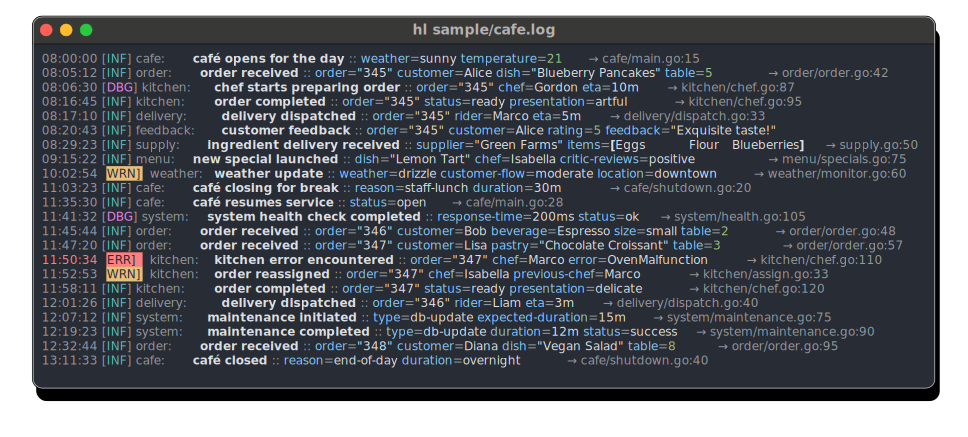

## Light mode

### Theme "uni"
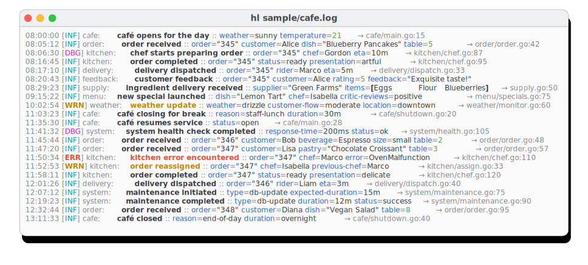

### Theme "hl-light"

### Theme "one-light-24"
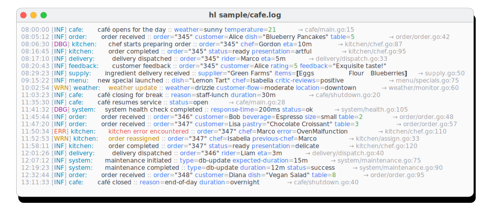

### Theme "ayu-light-24"
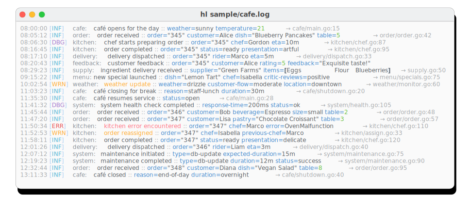

### Theme "ayu-mirage-24"

### Theme "classic-light"
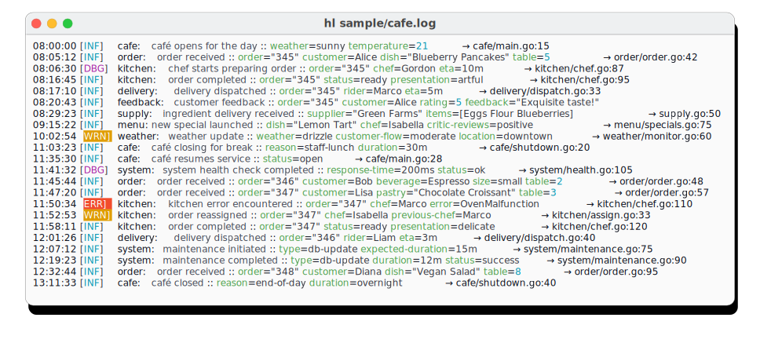

### Theme "classic-plus"

### Theme "dmt"

### Theme "lsd"

### Theme "neutral"
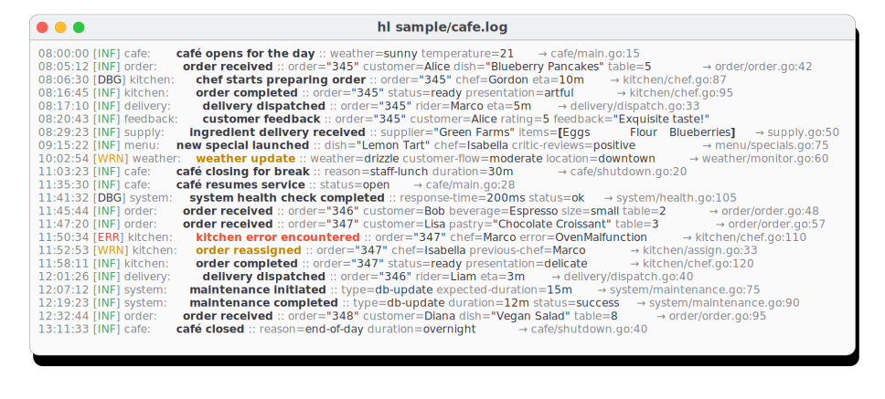

### Theme "one-dark-blue"

### Theme "one-dark-blue-truecolor"

### Theme "one-dark-blue-x"

### Theme "one-dark-green"

### Theme "one-dark-green-truecolor"

### Theme "one-dark-green-x"

### Theme "tc24l-blue"
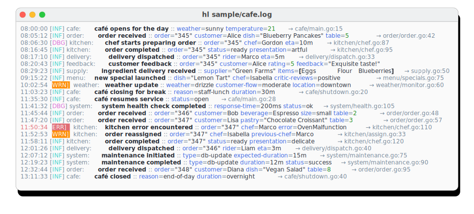

### Theme "tc24l-b2"
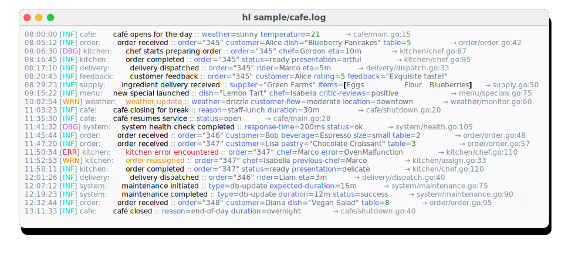

### Theme "universal"
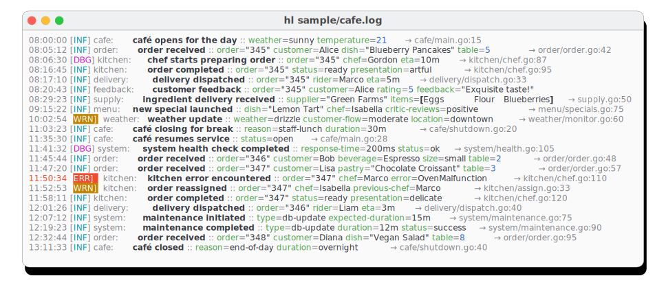

### Theme "universal-blue"

